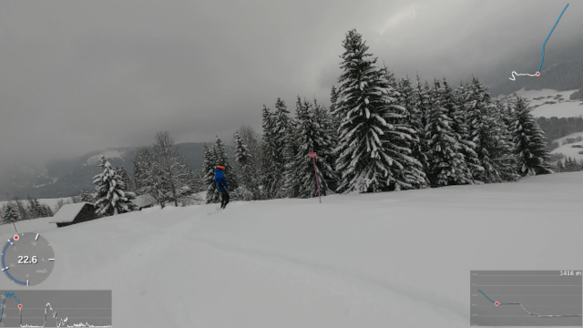
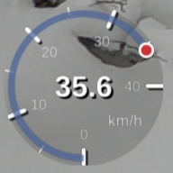
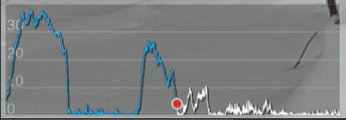
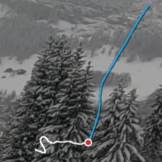
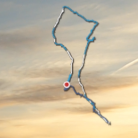
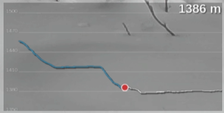
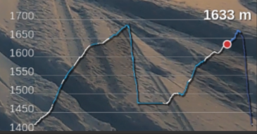
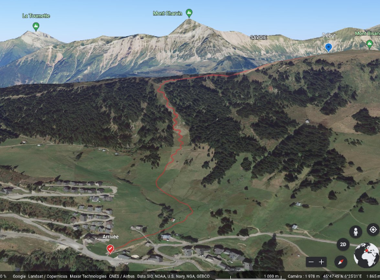

<p align="center">

<hr/>

# GPMFMetersGenerator
Generate skickers from GoPro's GPMF

## Usage

```
GPMFMetersGenerator [options] file.MP4
```
(launch GPMFMetersGenerator with **-h** argument to have a list of reconized options)
```
$ ./GPMFMetersGenerator -h
GPMFMetersGenerator v3.00a1
(c) L.Faillie (destroyedlolo) 2022

GPMFMetersGenerator [-options] Video.mp4

Known options :
-s[2|3|b] : enable speed gfx (default 2d, 3: 3d, b: both)
-k[2|3] : enable speed tracker gfx (default 2d, 3: 3d)
-a : enable altitude gfx
-p : enable path gfx
-X : export telemetry as GPX file
-K : export telemetry as KML file

-G<file> : load a GPX file
-S<file> : load a story file
	Only a GPX or a story can be loadded, not both

-V : Don't generate video, keep PNG files
-F : don't fail if the target directory exists
-v : turn verbose on
-d : turn debugging messages on
```

A directory with the same name of the mp4 file (without it's extention) will be created to
hold resulting images / Videos.

| :warning:WARNING:warning: : If you're upgrading from a previous version, please have a look on [Change file](CHANGES.md) ! |
| --- |

## Installation
### Dependancies 

- **Cairo** library is needed to generate PNG pics.
  - On source based distributions (Gentoo, ...), it sould be already installed if you're using a graphical environnement. Otherwise, install **x11-libs/cairo** package.
  - On binary based distributions (Debian, Suse ...), development version is needed. Please check for installation procedure [this page](https://www.cairographics.org/download/).
- **ffmpeg** binary vith **PNG** and **Quicktime** (.mov) support if you want GPMFMetersGenerator to generate videos.

### Compile from source

1. clone this repository
    ```
    git clone https://github.com/destroyedlolo/GPMFMetersGenerator
    ```
1.
    ```
    cd GPMFMetersGenerator
    ```
1. clone GoPro's [GPMF-parser](https://github.com/gopro/gpmf-parser) repository
    ```
    git clone https://github.com/gopro/gpmf-parser
    ```
1. build GPMFMetersGenerator
    ```
    make
    ```
1. copy **GPMFMetersGenerator** and **mkStory** in a directory in your PATH.
i.e :
    ```
    cp GPMFMetersGenerator mkStory /usr/local/bin
    ```
    
## Multiparts videos

Due to SD card's FAT limitation, GoPro camera split too longs videos in shorter chunks (on my Hero9, it seems earch chunk can't be longer than 3.7 GB so about 11 minutes in 1080p mode).

As of V2.03, **GPMFMetersGenerator** detects by itself the presence of additionnal part.

## Widgets



### Speed-O-Meter



Can be based on GPS' 2D or 3D speed figure ... or even both (*mostly for testing purpose*)

### Speed tracker



*In this graphic, only 2D or 3D can be displayed.*

:scroll: Notez-bien :  Even when a **story** is loaded, only the speed of the current video is displayed : 
*reason is there is no speed in GPX specification.*

### Path




Displays the north-facing path. By loading an external **GPX files**, the global path is displayed with the video highlighted based its telemetry.



:scroll: More, by loading a **story** (instead of a GPX file), all videos are highlighted on the track.<br>
:warning: only the current video is traced upon GoPro telemetry. Others are from GPX datas.

### Altitude




:scroll: by adding a **story**, the full session is displayed, and the part covered by videos highlighted.


### KML and GPX file generation

**GPMFMetersGenerator** can export GoPro's metrics into [KML](https://en.wikipedia.org/wiki/Keyhole_Markup_Language) or [GPX](https://en.wikipedia.org/wiki/GPS_Exchange_Format) file than can be included in a 3rd party GIS like **Google Map**, **Google Earth**, **OpenStreetMap** or such.



# Stories

Primarily designed for activities such as hiking, trekking, ski touring, mountain biking, or simply strolling, **stories** attempt to establish the timeline between a GPX track and GoPro videos to generate additional figures.

## data matching

Unfortunately, GPS data gathered by your phone and GoPro are not exactly the same  : lost of satellites, precision issues or simply the fact the GoPro may start recording without having fully acquired satellites.
In addition, I noticed the tracking application I'm using, Decathlon Coach, generates incomplete or crappy data GPX (especially when "Auto Stop" is enabled).

## mkStory

Based on locations and chronology, mkStory will try to guess when each provided videos stars and ends on a GPX file timeline.

```
$ ./mkStory -h

mkStory v0.01a01
(c) L.Faillie (destroyedlolo) 2022

mkStory [-options] video.mp4 ...
Known opts :
-G<file> : GPX of the hiking
-F : force video inclusion

-v : turn verbose on
-d : turn debugging messages on
```

:warning:NOTEZ-BIEN:warning: : videos have to be provided in chronological order, otherwise the result will be void.

```
./mkStory -G ~/Images/Brute/20220212_Semnoz/nice.gpx ~/Images/Brute/20220212_Semnoz/GX01*.MP4
*O* Generating story in '/home/laurent/Images/Brute/20220212_Semnoz/nice.story'
*L* Reading '/home/laurent/Images/Brute/20220212_Semnoz/GX013158.MP4'
*L* Reading '/home/laurent/Images/Brute/20220212_Semnoz/GX013159.MP4'
*L* Reading '/home/laurent/Images/Brute/20220212_Semnoz/GX013162.MP4'
*L* Reading '/home/laurent/Images/Brute/20220212_Semnoz/GX013168.MP4'
*L* Reading '/home/laurent/Images/Brute/20220212_Semnoz/GX013169.MP4'
*L* Reading '/home/laurent/Images/Brute/20220212_Semnoz/GX013170.MP4'
*L* Reading '/home/laurent/Images/Brute/20220212_Semnoz/GX013173.MP4'
*L* Reading '/home/laurent/Images/Brute/20220212_Semnoz/GX013175.MP4'
*L* Reading '/home/laurent/Images/Brute/20220212_Semnoz/GX013181.MP4'
*L* Reading '/home/laurent/Images/Brute/20220212_Semnoz/GX013183.MP4'
*I* results summaries
 ----------------------------------------------------------------------
| GPX : 2022-02-12T15:12:02+0100 -> 2022-02-12T16:52:33+0100
| Distance traveled : 7266 m
 --------------------------------------------------------------------------------------------------------
|    video     |         Beginning         |            End            |            Timestamps           | Status
|              | Index | Estrgmt  | CumDis | Index | Estrgmt  | CumDis |       GPX      |       GoPro    |
 --------------------------------------------------------------------------------------------------------
| GX013158.MP4 | 00227 |     12.6 |    464 | 00273 |      1.5 |    549 | 15:20 -> 15:22 | 15:23 -> 15:27 |  ok
| GX013159.MP4 | 00273 |      1.8 |    549 | 00328 |      3.0 |    649 | 15:22 -> 15:24 | 15:28 -> 15:31 |  ok
| GX013162.MP4 | 00360 |      5.3 |    703 | 00469 |      1.9 |    906 | 15:25 -> 15:30 | 15:34 -> 15:39 |  ok
| GX013168.MP4 | 00666 |      0.4 |   1282 | 00749 |      3.1 |   1457 | 15:37 -> 15:40 | 16:05 -> 16:08 |  ok
| GX013169.MP4 | 00887 |      0.8 |   1793 | 01085 |      1.0 |   2211 | 15:45 -> 15:53 | 16:13 -> 16:21 |  ok
| GX013170.MP4 | 01086 |      1.0 |   2211 | 01513 |      1.1 |   3762 | 15:53 -> 16:11 | 16:35 -> 16:41 |  ok
| GX013173.MP4 | 01698 |      1.8 |   4206 | 01812 |      2.0 |   4465 | 16:18 -> 16:22 | 17:11 -> 17:16 |  ok
| GX013175.MP4 | 01846 |      2.8 |   4559 | 01995 |      0.7 |   4894 | 16:24 -> 16:30 | 17:22 -> 17:29 |  ok
| GX013181.MP4 | 02244 |      3.0 |   5443 | 02422 |      2.9 |   5802 | 16:39 -> 16:46 | 17:41 -> 17:48 |  ok
| GX013183.MP4 | 02422 |      3.4 |   5802 | 02551 |      1.9 |   7240 | 16:46 -> 16:51 | 18:04 -> 18:09 |  ok
```
For each of the videos, the summary displays: 
- Guessed the corresponding **start and end GPX indexes** and **estrangements** between the GoPro and GPX localizations.
- **Timestamps** (*and you can see severe drifts of GPX ones due to a brain-damaged algorithm : the GoPro one is accurate as got from the GPS itself*).
- A "**quality status**" as following :
  - **ok** - seems to be good
  - **No GPS** - No satellite locked (*it's probably better to avoid this video in the story*)
  - **Partial GPS** - Missing satellite during the video
  - **Bad signal** - Weak GPS signal during the whole video
  - **Weak signal** - Weak GPS signal partially during the video
  - **not ending** - can't find an ending point for the video (generally due to the GPX to stopped before the video or a video not part of this hiking)
  - **Overlapping** - videos overlap (or due to a mistake in mkStory guesses, or because one of the video is not part of the hiking).

## what to do in case of issues

Generated .story file are flat files : if mkStory didn't do right job, you may edit it to sheat indexes. Adding '-d' option at mkStory invocation will help to know GPX's indexes (but it's very verbose). 

# Small tutorials

[](https://www.youtube.com/watch?v=suNsHcW_mJ0 "How to add your GoPro tracks into Google Earth (or Maps)")
[](https://www.youtube.com/watch?v=9xHZUzn8XDk "Add GoPro's telemetry stickers on your videos using GPMFMetersGenerator and Shotcut")
 
## TODO list

Here the list of already known needed improvements (as of V2)

- [X] Multi part video handling
- [X] Speedup images generation
- [X] Colorizes past figures
- [X] Show full journey using external GPX trace file (*need to create a Fixer as the ones I got are crappy*)
- [X] Generate GPX and KML from telemetry
- [ ] Inlays video's path on a map
- [ ] Add threading support to parallelise images' generation.
- [ ] Better support of timewrap video (for the moment, the result is a bit crappy)
