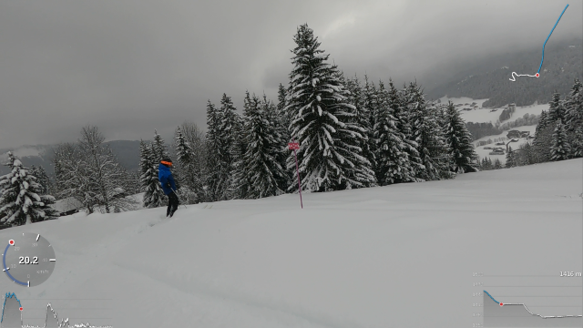

<p align="center">

<hr/>

# GPMFMetersGenerator
Generate skickers from GoPro's GPMF

## Usage

```
GPMFMetersGenerator [options] file.MP4
```
(launch GPMFMetersGenerator with **-h** argument to have a list of reconized options)
```
$ ./GPMFMetersGenerator -h
GPMFMetersGenerator v3.00a1
(c) L.Faillie (destroyedlolo) 2022

GPMFMetersGenerator [-options] Video.mp4

Known options :
-s[2|3|b] : enable speed gfx (default 2d, 3: 3d, b: both)
-k[2|3] : enable speed tracker gfx (default 2d, 3: 3d)
-a : enable altitude gfx
-p : enable path gfx
-X : export telemetry as GPX file
-K : export telemetry as KML file

-G<file> : load a GPX file
-S<file> : load a story file
	Only a GPX or a story can be loadded, not both

-V : Don't generate video, keep PNG files
-F : don't fail if the target directory exists
-v : turn verbose on
-d : turn debugging messages on
```

A directory with the same name of the mp4 file (without it's extention) will be created to
hold resulting images / Videos.

| :warning:WARNING:warning: : If you're upgrading from a previous version, please have a look on [Change file](CHANGES.md) ! |
| --- |

## Installation
### Dependancies 

- **Cairo** library is needed to generate PNG pics.
  - On source based distributions (Gentoo, ...), it sould be already installed if you're using a graphical environnement. Otherwise, install **x11-libs/cairo** package.
  - On binary based distributions (Debian, Suse ...), development version is needed. Please check for installation procedure [this page](https://www.cairographics.org/download/).
- **ffmpeg** binary vith **PNG** and **Quicktime** (.mov) support if you want GPMFMetersGenerator to generate videos.

### Compile from source

1. clone this repository
    ```
    git clone https://github.com/destroyedlolo/GPMFMetersGenerator
    ```
1.
    ```
    cd GPMFMetersGenerator
    ```
1. clone GoPro's [GPMF-parser](https://github.com/gopro/gpmf-parser) repository
    ```
    git clone https://github.com/gopro/gpmf-parser
    ```
1. build GPMFMetersGenerator
    ```
    make
    ```
1. copy **GPMFMetersGenerator** and **mkStory** in a directory in your PATH.
i.e :
    ```
    cp GPMFMetersGenerator mkStory /usr/local/bin
    ```
    
## Multiparts videos

Due to SD card's FAT limitation, GoPro camera split too longs videos in shorter chunks (on my Hero9, it seems earch chunk can't be longer than 3.7 GB so about 11 minutes in 1080p mode).

As of V2.03, **GPMFMetersGenerator** detects by itself the presence of additionnal part.

## Widgets



### Speed-O-Meter


Can be based on GPS' 2D or 3D speed figure ... or even both (*mostly for testing purpose*)

### Speed tracker


*In this graphic, only 2D or 3D can be displayed.*

:scroll: Notez-bien :  Even when a **story** is loaded, only the speed of the current video is displayed : 
*reason is there is no speed in GPX specification.*

### Path


Displays the north-facing path. By loading an external **GPX files**, the global path is displayed with the video highlighted based its telemetry.


:scroll: More, by loading a **story** (instead of a GPX file), all videos are highlighted on the track.<br>
:warning: only the current video is traced upon GoPro telemetry. Others are from GPX datas.

### Altitude


:scroll: by adding a **story**, the full session is displayed, and the part covered by videos highlighted.


### KML and GPX file generation

**GPMFMetersGenerator** can export GoPro's metrics into [KML](https://en.wikipedia.org/wiki/Keyhole_Markup_Language) or [GPX](https://en.wikipedia.org/wiki/GPS_Exchange_Format) file than can be included in a 3rd party GIS like **Google Map**, **Google Earth**, **OpenStreetMap** or such.


## Small tutorials

[](https://www.youtube.com/watch?v=suNsHcW_mJ0 "How to add your GoPro tracks into Google Earth (or Maps)")
[](https://www.youtube.com/watch?v=9xHZUzn8XDk "Add GoPro's telemetry stickers on your videos using GPMFMetersGenerator and Shotcut")
 
## TODO list

Here the list of already known needed improvements (as of V2)

- [X] Multi part video handling
- [X] Speedup images generation
- [X] Colorizes past figures
- [ ] Show full journey using external GPX trace file (*need to create a Fixer as the ones I got are crappy*)
- [X] Generate GPX and KML from telemetry
- [ ] Inlays video's path on a map
- [ ] Add threading support to parallelise images' generation.
- [ ] Better support of timewrap video (for the moment, the result is a bit crappy)
