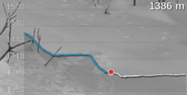

<p align="center">

<hr/>

# GPMFMetersGenerator
Generate skickers from GoPro's GPMF

## Usage

```
GPMFMetersGenerator [options] file.MP4
```
(launch GPMFMetersGenerator without argument to have a list of reconized options)

A directory with the same name of the mp4 file (without it's extention) will be created to
hold resulting images / Videos.

## Dependancies 

- **Cairo** library is needed to generate PNG pics.
  - On source based distributions (Gentoo, ...), it sould be already installed if you're using a graphical environnement. Otherwise, install **x11-libs/cairo** package.
  - On binary based distributions (Debian, Suse ...), development version is needed. Please check for installation procedure [this page](https://www.cairographics.org/download/).
- **ffmpeg** binary vith **PNG** and **Quicktime** (.mov) support if you want GPMFMetersGenerator to generate videos.

## Installation

1. clone this repository
    ```
    git clone https://github.com/destroyedlolo/GPMFMetersGenerator
    ```
1.
    ```
    cd GPMFMetersGenerator
    ```
1. clone GoPro's [GPMF-parser](https://github.com/gopro/gpmf-parser) repository
    ```
    git clone https://github.com/gopro/gpmf-parser
    ```
1. build GPMFMetersGenerator
    ```
    make
    ```

## Multiparts videos

Due to SD card's FAT limitation, GoPro camera split too longs videos in shorter chunks (on my Hero9, it seems earch chunk can't be longer than 3.7 GB so about 11 minutes in 1080p mode).

As per V0.8, more than one videos can be specified in the command line and GPMF data will be agregated as if they were from an uniq video (*take care to put them in the right order*)

## Current widgets


### Speed-O-Meter


Can be based on GPS' 2D or 3D speed figure ... or even both (*mostly for testing purpose*)

### Speed tracker


*In this graphic, only 2D or 3D can be displayed.*

### Path


Displays the north-facing path. Based on own video's telemetry or on external GPX files (*typical use: when hiking or ski touring*). 

### Altitude



## TODO list

Here the list of already known needed improvements

- [X] Multi part video handling
- [ ] Better support of timewrap video (for the moment, the result is a bit crappy)
- [X] Speedup images generation
- [X] Colorizes past figures
- [ ] Inlays video's path on a map
- [ ] Add threading support to parallelise images' generation. 
