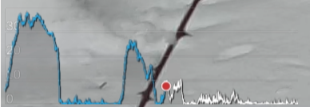

<p align="center">
<br>
(no commit for long time doesn't mean this project is stalling but reached a stable state and I switched to others activities :relaxed:)
<hr/>

# GPMFMetersGenerator
Generate skickers from GoPro's GPMF

## Usage

```
GPMFMetersGenerator [options] file.MP4
```
(launch GPMFMetersGenerator with **-h** argument to have a list of reconized options)
```
$ ./GPMFMetersGenerator -h
GPMFMetersGenerator v4.03.00
(c) L.Faillie (destroyedlolo) 2022-23

GPMFMetersGenerator [-options] Video.mp4

Known options :
-s[2|3|b] : enable speed gfx (default 2d, 3: 3d, b: both)
-k[2|3] : enable speed tracker gfx (default 2d, 3: 3d)
-a : enable altitude gfx and draw curve from GoPro video
-A : enable altitude gfx and draw curve from GPX/story
-p : enable path gfx
-q : enable quality gfx
-t : enable Trekking statistics (HH:MM)
-T : enable Trekking statistics (HH:MM:SS)

-X : export telemetry as GPX file
-K : export telemetry as KML file

-G<file> : load a GPX file
-S<file> : load a story file
	Only a GPX or a story can be loadded, not both

-V : Don't generate video, keep PNG files
-Q : enforce quality by removing samples where GoP is > 500
-F : don't fail if the target directory exists
-v : turn verbose on
-d : turn debugging messages on
```

A directory with the same name of the mp4 file (without it's extention) will be created to
hold resulting images / Videos.

| :warning:WARNING:warning: : If you're upgrading from a previous version, please have a look on [Change file](CHANGES.md) ! |
| --- |

## Installation
### Dependancies 

- **Cairo** library is needed to generate PNG pics.
  - On source based distributions (Gentoo, ...), it sould be already installed if you're using a graphical environnement. Otherwise, install **x11-libs/cairo** package.
  - On binary based distributions (Debian, Suse ...), development version is needed. Please check for installation procedure [this page](https://www.cairographics.org/download/).
- **ffmpeg** binary vith **PNG** and **Quicktime** (.mov) support if you want GPMFMetersGenerator to generate videos.

### Compile from source

1. clone this repository
    ```
    git clone https://github.com/destroyedlolo/GPMFMetersGenerator
    ```
1.
    ```
    cd GPMFMetersGenerator
    ```
1. clone GoPro's [GPMF-parser](https://github.com/gopro/gpmf-parser) repository
    ```
    git clone https://github.com/gopro/gpmf-parser
    ```
1. build GPMFMetersGenerator
    ```
    make
    ```
1. copy **GPMFMetersGenerator** and **mkStory** in a directory in your PATH.
i.e :
    ```
    cp GPMFMetersGenerator mkStory /usr/local/bin
    ```
    
## Multiparts videos

Due to SD card's FAT limitation, GoPro camera split too longs videos in shorter chunks (on my Hero9, it seems earch chunk can't be longer than 3.7 GB so about 11 minutes in 1080p mode).

As of V2.03, **GPMFMetersGenerator** detects by itself the presence of additionnal part.

## Activity related stickers


### Speed-O-Meter


Can be based on GPS' 2D or 3D speed figure ... or even both (*mostly for testing purpose*)

### Speed tracker



*In this graphic, only 2D or 3D can be displayed.*

:scroll: Notez-bien :  Even when a **story** is loaded, only the speed of the current video is displayed : 
*reason is there is no speed in GPX specification.*

### Path


Displays the north-facing path. By loading an external **GPX files**, the global path is displayed with the video highlighted based its telemetry.


:scroll: More, by loading a **story** (instead of a GPX file), all videos are highlighted on the track.<br>
:warning: only the current video is traced upon GoPro telemetry. Others are from GPX datas.

### Altitude


:scroll: by adding a **story**, the full session is displayed, and the part covered by videos highlighted.
Current video data are took from
- '**-a**' flag : from the GoPro meta data. 
- '**-A**' flag : from the data contained in the GPX tracking (from a GPX file or from a stories). Data of the GPX files can be smoothed if obtained from transcoding tables (WGS84, EGM96, ...) creating *unsightly "jumps"* when switching from GPX curves to GoPro data. With '-A' the graphs are only based on GPX data.

The floating dot and the value displayed always come from GoPro data.

### Trekking statistics


Display **distance travelled** and **duration** since the beginning of the video *or* of the full hiking if included in a story. 

## Technical stickers

### <a name="GPSqual"></a>GPS signal quality


This sticker displays the GPS' [Dilution of Precision](https://en.wikipedia.org/wiki/Dilution_of_precision_(navigation)) where values **< 500** are considered as good, and the signal Fix that can be :
- 0 : no lock
- 2 : 2D only lock
- 3 : 3D lock

## KML and GPX file generation

**GPMFMetersGenerator** can export GoPro's metrics into [KML](https://en.wikipedia.org/wiki/Keyhole_Markup_Language) or [GPX](https://en.wikipedia.org/wiki/GPS_Exchange_Format) file than can be included in a 3rd party GIS like **Google Map**, **Google Earth**, **OpenStreetMap** or such.


---

# Stories

A story is a way to group data from several sources : so even if a video covers only a part, telemetry stickers will reflect all the activity.

| :exclamation: | **Notez-bien :** Stories are for advanced users and are not mandatory to generate stickers. Especially, they are unuseful if you want to generate stickers for a single video :sunglasses:  |
|-------------|----------------------------|

To add a story while generating stickers, provide its file using **-S** option to **GPMFMetersGenerator**.

## Story from a set of videos

You may want to film an activity without being able to do it in one shot (also known as "*have to wait for friends on a long down hill*"). A story can be used to group telemetries of all parts, as if took from a single video.

**some obvious remarks :**
* If you're doing pauses during your activity, the **distance, path and altitude tracking will be accurate**, but the duration will reflect the difference between the beginning and time of the recording and not the cumulative time of effort.
* If you stop the recording but continue your activity, the **duration** will be right but not the distance. Altitude and path will contain straight shortcuts.

### mkStory

**mkStory** will build your story from videos only if there is no **-G** provided, so no GPX file.

```
$ mkStory GX01463[789].MP4 GX01464[0234567].MP4
*L* Reading 'GX014637.MP4'
*L* Reading 'GX014638.MP4'
*L* Reading 'GX014639.MP4'
*L* Reading 'GX014640.MP4'
*L* Reading 'GX014642.MP4'
*L* Reading 'GX014643.MP4'
*L* Reading 'GX014644.MP4'
*L* Reading 'GX014645.MP4'
*L* Reading 'GX014646.MP4'
*L* Reading 'GX014647.MP4'
```

## Story from a GPX file

While doing long activities such as hiking, trekking, ski touring, mountain biking, or simply strolling, generally we are recording only small interesting parts and not the global session. In parallel, phones' sport tracker applications can provide complete trace of the activity.

**Stories**  attempt to establish the timeline between a GPX track coming from your phone and the GoPro videos metadata to get a global view of your activity in videos.

### data matching

Unfortunately, GPS position gathered by your phone and GoPro are not exactly the same  : satellites lost, precision issues or simply the fact the GoPro may start recording without having fully acquired satellites (use [GPS signal quality](#GPSqual) stickers to check your signal quality).

Even worst, the altitude is *calculated* by GPSes : Android's algorithm is by far less precise compared to GoPro one and tends to smooth the result.
This is leading to *jumps* when switching between GPX and GoPro curves. See GPMFMetersGenerator '**-a**' vs '**-A**' discuss above.

### mkStory

**mkStory** tries to match videos' metadata with phone provided GPX timeline.

```
$ ./mkStory -h

mkStory v3.03.00
(c) L.Faillie (destroyedlolo) 2022

mkStory [-options] video.mp4 ...
Known opts :
-G<file> : GPX of the hiking
-F : force video inclusion
-P : use position instead of GPX' timestamps

-v : turn verbose on
-d : turn debugging messages on
```

:warning:NOTEZ-BIEN:warning: : videos have to be provided in chronological order, otherwise the result will be void.

```
./mkStory -G ~/Images/Brute/20220212_Semnoz/nice.gpx ~/Images/Brute/20220212_Semnoz/GX01*.MP4
*O* Generating story in '/home/laurent/Images/Brute/20220212_Semnoz/nice.story'
*L* Reading '/home/laurent/Images/Brute/20220212_Semnoz/GX013158.MP4'
*L* Reading '/home/laurent/Images/Brute/20220212_Semnoz/GX013159.MP4'
*L* Reading '/home/laurent/Images/Brute/20220212_Semnoz/GX013162.MP4'
*L* Reading '/home/laurent/Images/Brute/20220212_Semnoz/GX013168.MP4'
*L* Reading '/home/laurent/Images/Brute/20220212_Semnoz/GX013169.MP4'
*L* Reading '/home/laurent/Images/Brute/20220212_Semnoz/GX013170.MP4'
*L* Reading '/home/laurent/Images/Brute/20220212_Semnoz/GX013173.MP4'
*L* Reading '/home/laurent/Images/Brute/20220212_Semnoz/GX013175.MP4'
*L* Reading '/home/laurent/Images/Brute/20220212_Semnoz/GX013181.MP4'
*L* Reading '/home/laurent/Images/Brute/20220212_Semnoz/GX013183.MP4'
*I* results summaries
 ----------------------------------------------------------------------
| GPX : 2022-02-12T15:12:02+0100 -> 2022-02-12T16:52:33+0100
| Distance traveled : 7266 m
 --------------------------------------------------------------------------------------------------------
|    video     |         Beginning         |            End            |            Timestamps           | Status
|              | Index | Estrgmt  | CumDis | Index | Estrgmt  | CumDis |       GPX      |       GoPro    |
 --------------------------------------------------------------------------------------------------------
| GX013158.MP4 | 00227 |     12.6 |    464 | 00273 |      1.5 |    549 | 15:20 -> 15:22 | 15:23 -> 15:27 |  ok
| GX013159.MP4 | 00273 |      1.8 |    549 | 00328 |      3.0 |    649 | 15:22 -> 15:24 | 15:28 -> 15:31 |  ok
| GX013162.MP4 | 00360 |      5.3 |    703 | 00469 |      1.9 |    906 | 15:25 -> 15:30 | 15:34 -> 15:39 |  ok
| GX013168.MP4 | 00666 |      0.4 |   1282 | 00749 |      3.1 |   1457 | 15:37 -> 15:40 | 16:05 -> 16:08 |  ok
| GX013169.MP4 | 00887 |      0.8 |   1793 | 01085 |      1.0 |   2211 | 15:45 -> 15:53 | 16:13 -> 16:21 |  ok
| GX013170.MP4 | 01086 |      1.0 |   2211 | 01513 |      1.1 |   3762 | 15:53 -> 16:11 | 16:35 -> 16:41 |  ok
| GX013173.MP4 | 01698 |      1.8 |   4206 | 01812 |      2.0 |   4465 | 16:18 -> 16:22 | 17:11 -> 17:16 |  ok
| GX013175.MP4 | 01846 |      2.8 |   4559 | 01995 |      0.7 |   4894 | 16:24 -> 16:30 | 17:22 -> 17:29 |  ok
| GX013181.MP4 | 02244 |      3.0 |   5443 | 02422 |      2.9 |   5802 | 16:39 -> 16:46 | 17:41 -> 17:48 |  ok
| GX013183.MP4 | 02422 |      3.4 |   5802 | 02551 |      1.9 |   7240 | 16:46 -> 16:51 | 18:04 -> 18:09 |  ok
```
For each of the videos, the summary displays: 
- Guessed the corresponding **start and end GPX indexes** and **estrangements** between the GoPro and GPX localizations.
- **Timestamps** (*and you can see severe drifts of GPX ones due to a brain-damaged algorithm : the GoPro one is accurate as got from the GPS itself*).
- A "**quality status**" as following :
  - **ok** - seems to be good
  - **No GPS** - No satellite locked (*it's probably better to avoid this video in the story*)
  - **Partial GPS** - Missing satellite during the video
  - **Bad signal** - Weak GPS signal during the whole video
  - **Weak signal** - Weak GPS signal partially during the video
  - **not ending** - can't find an ending point for the video (generally due to the GPX to stopped before the video or a video not part of this hiking)
  - **Overlapping** - videos overlap (or due to a mistake in mkStory guesses, or because one of the video is not part of the hiking).

Bad example :
```
*I* results summaries
 ----------------------------------------------------------------------
| GPX : 2022-05-27T13:53:49+0200 -> 2022-05-27T14:46:59+0200
| Distance traveled : 4240 m
 --------------------------------------------------------------------------------------------------------
|    video     |         Beginning         |            End            |            Timestamps           | Status
|              | Index | Estrgmt  | CumDis | Index | Estrgmt  | CumDis |       GPX      |       GoPro    |
 --------------------------------------------------------------------------------------------------------
| GX013845.MP4 | 00091 |  12071.4 |    285 | 00092 |  12071.8 |    287 | 13:57 -> 13:57 | 13:58 -> 13:59 |  No GPS
| GX013846.MP4 | 00091 |  12071.4 |    285 | 00092 |  12071.8 |    287 | 13:57 -> 13:57 | 13:59 -> 14:00 |  No GPS
| GX013850.MP4 | 00091 |  12071.4 |    285 | 00092 |  12071.8 |    287 | 13:57 -> 13:57 | 14:05 -> 14:06 |  No GPS
| GX013851.MP4 | 00091 |  12071.4 |    285 | 00092 |  12071.8 |    287 | 13:57 -> 13:57 | 14:07 -> 14:07 |  No GPS
| GX013853.MP4 | 00091 |  12071.4 |    285 | 00225 |   2627.8 |    792 | 13:57 -> 14:03 | 14:09 -> 14:09 |  No GPS
| GX013854.MP4 | 00225 |   2627.8 |    792 | 00226 |   2631.7 |    798 | 14:03 -> 14:03 | 14:10 -> 14:10 |  No GPS
| GX013856.MP4 | 00225 |   2463.8 |    792 | 00226 |   2316.1 |    798 | 14:03 -> 14:03 | 14:11 -> 14:12 |  No GPS
| GX013861.MP4 | 00281 |      9.3 |   1036 | 00300 |     10.7 |   1107 | 14:05 -> 14:06 | 14:31 -> 14:32 |  Weak signal
| GX013865.MP4 | 00385 |      8.8 |   1458 | 00389 |     17.9 |   1472 | 14:09 -> 14:10 | 14:53 -> 14:54 |  Weak signal
| GX013870.MP4 | 00530 |      2.3 |   1890 | 00538 |      6.0 |   1906 | 14:16 -> 14:16 | 15:14 -> 15:15 |  ok
| GX013872.MP4 | 00568 |      2.1 |   2028 | 00569 |      4.9 |   2029 | 14:17 -> 14:17 | 15:23 -> 15:24 |  ok
| GX013875.MP4 | 00668 |      3.4 |   2431 | 00670 |      5.5 |   2439 | 14:22 -> 14:22 | 15:42 -> 15:42 |  ok
| GX013877.MP4 | 00736 |      2.5 |   2610 | 00790 |      4.1 |   2774 | 14:24 -> 14:27 | 15:50 -> 15:53 |  Weak signal
| GX013882.MP4 | 01120 |      4.3 |   3810 | 01128 |      5.4 |   3838 | 14:40 -> 14:41 | 16:38 -> 16:39 |  Weak signal
| GX013883.MP4 | 01128 |      2.4 |   3838 | 01192 |      4.0 |   4052 | 14:41 -> 14:43 | 16:39 -> 16:41 |  ok
| GX013885.MP4 | 01259 |      5.9 |   4236 | 01260 |     14.4 |   4238 | 14:46 -> 14:46 | 16:49 -> 16:49 |  ok
*W* At least Problem has been detected
```

### what to do in case of issues

#### Time vs position based guessing

By default, mkStory uses timestamps for matching.

In some cases, the GPX files do not contain reliable timestamps (for example, when using *autopause* on **Decathlon coach**, the timestamps are totally crap). In this case, use the '**-P**' flag to switch to "positioning" mode: mkStory will attempt to guess the insertion points of the videos based on positional matches.

| :warning: | "Positioning" mode is much more *random* than timestamp mode.<br> The results are better if there is no path overlap, but in the case of a round trip, it is really difficult to have a correct result (I am working on a better algorithm).  |
|-------------|----------------------------|

#### Last chance : manuel edition (good luck)

Generated .story file are flat files : if mkStory didn't do right job, you may edit it to sheat indexes. Adding '-v' or even '-d' option at mkStory invocation will help to know GPX's indexes (but it's very verbose).

---

# Small tutorials

[](https://www.youtube.com/watch?v=suNsHcW_mJ0 "How to add your GoPro tracks into Google Earth (or Maps)")
[](https://www.youtube.com/watch?v=9xHZUzn8XDk "Add GoPro's telemetry stickers on your videos using GPMFMetersGenerator and Shotcut")

---

# TODO list

Here the list of already known needed improvements (as of V3)

- [X] Multi part video handling
- [X] Speedup images generation
- [X] Colorizes past figures
- [X] Show full journey using external GPX trace file (*need to create a Fixer as the ones I got are crappy*)
- [X] Generate GPX and KML from telemetry
- [ ] Generate stories directly form a collection of video, without GPX file
- [ ] Inlays video's path on a map (**high probability** : must have)
- [ ] Post process GPX data to get better altitudes (**meddium probability** : it will require lot of development - does it worth it ?)
- [ ] Add threading support to parallelise images' generation (**low probability** : requires a bit of code redesign, but the gain won't be so significant as most of the time spent is by video encoding, which is already parallelized). 

---

# Licencing and contributing

**GPMFMetersGenerator** is covered by [Creative Commons-BY-NC](http://creativecommons.org/licenses/by-nc/3.0/) preventing *vampires* to abuse open source developers kindness : Please raise a ticket if you want to integrate it in a commercial product.

**Feel free to participate** : code improvements, new features implementation, beer to developers, gifts, thanks messages :clap: ... Participations help to make projects alive.
