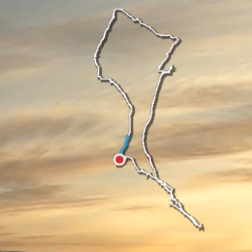

<p align="center">

<hr/>

# GPMFMetersGenerator
Generate skickers from GoPro's GPMF

## Usage

```
GPMFMetersGenerator [options] file.MP4
```
(launch GPMFMetersGenerator without argument to have a list of reconized options)

A directory with the same name of the mp4 file (without it's extention) will be created to
hold resulting images / Videos.

## Dependancies 

- **Cairo** library is needed to generate PNG pics.
  - On source based distributions (Gentoo, ...), it sould be already installed if you're using a graphical environnement. Otherwise, install **x11-libs/cairo** package.
  - On binary based distributions (Debian, Suse ...), development version is needed. Please check for installation procedure [this page](https://www.cairographics.org/download/).
- **ffmpeg** binary vith **PNG** and **Quicktime** (.mov) support if you want GPMFMetersGenerator to generate videos.

## Installation

1. clone this repository
    ```
    git clone https://github.com/destroyedlolo/GPMFMetersGenerator
    ```
1.
    ```
    cd GPMFMetersGenerator
    ```
1. clone GoPro's [GPMF-parser](https://github.com/gopro/gpmf-parser) repository
    ```
    git clone https://github.com/gopro/gpmf-parser
    ```
1. build GPMFMetersGenerator
    ```
    make
    ```

## Multiparts videos

Due to SD card's FAT limitation, GoPro camera split too longs videos in shorter chunks (on my Hero9, it seems earch chunk can't be longer than 3.7 GB so about 11 minutes in 1080p mode).

As per V0.8, more than one videos can be specified in the command line and GPMF data will be agregated as if they were from an uniq video (*take care to put them in the right order*)

## Current widgets


### Speed-O-Meter


Can be based on GPS' 2D or 3D speed figure ... or even both (*mostly for testing purpose*)

### Speed tracker


*In this graphic, only 2D or 3D can be displayed.*

### Path




Displays the north-facing path. Based on own video's telemetry or on external GPX files (*typical use: when hiking or ski touring*). 

### Altitude


### KML and GPX file generation

**GPMFMetersGenerator** can export GoPro's metrics into [KML](https://en.wikipedia.org/wiki/Keyhole_Markup_Language) or [GPX](https://en.wikipedia.org/wiki/GPS_Exchange_Format) file than can be included in a 3rd party GIS like **Google Map**, **Google Earth**, **OpenStreetMap** or such.


## Small tutorials

[](https://www.youtube.com/watch?v=suNsHcW_mJ0 "How to add your GoPro tracks into Google Earth (or Maps)")
[](https://www.youtube.com/watch?v=9xHZUzn8XDk "Add GoPro's telemetry stickers on your videos using GPMFMetersGenerator and Shotcut")

## Technical limitations

### Glibc dependancies

Timestamp reading requires some Glibc own features.
To lazy to recode it to portable way ... but patches are welcome :)

### Reading GPX file

As per **GPM Meter Generator** v1.xx and in order to reduce amount of dependencies, **GPX** file parser is simple and perfectible mainly to handle files generated by [Decathlon Coach](https://www.decathloncoach.com/) activity tracker. Consequently, XML syntax is **NOT** subject to any validation

**GPM Meter Generator** looks 
- first for `<trkpt>` tags to extract positions
- then `<ele>` for the elevation
- then `<time>` for the sample time, complying to a subset of *ISO 8601* format like `2022-01-30T12:24:08+01:00` or `2022-01-30T12:24:08+01:00Z`

Valid file looks like
```
<?xml version="1.0" encoding="utf-8"?>
<gpx xmlns="http://www.topografix.com/GPX/1/1" xmlns:gpxtpx="http://www.garmin.com/xmlschemas/TrackPointExtension/v1" xmlns:xsi="http://www.w3.org/2001/XMLSchema-instance" version="1.1" creator="SportTrackingData" xsi:schemaLocation="http://www.topografix.com/GPX/1/1 http://www.topografix.com/GPX/1/1/gpx.xsd http://www.garmin.com/xmlschemas/TrackPointExtension/v1 http://www.garmin.com/xmlschemas/TrackPointExtensionv1.xsd">
  <metadata>
    <name>Ski</name>
    <time>2022-01-30T12:24:08+01:00</time>
  </metadata>
  <trk>
    <name>Ski</name>
    <trkseg>
      <trkpt lat="45.883527732062" lon="6.4339264194616">
        <ele>1218.6006</ele>
        <time>2022-01-30T12:24:08+01:00</time>
      </trkpt>
      <trkpt lat="45.883584849482" lon="6.433912497078">
        <ele>1218.1006</ele>
        <time>2022-01-30T12:24:12+01:00</time>
      </trkpt>
      </trkpt>
    </trkseg>
  </trk>
</gpx>
```

but only the following is understood **IN THIS ORDER** (in other words, swapping `<ele>` and `<time>` leads to data loss)
```
      <trkpt lat="45.883527732062" lon="6.4339264194616">
        <ele>1218.6006</ele>
        <time>2022-01-30T12:24:08+01:00</time>
      <trkpt lat="45.883584849482" lon="6.433912497078">
        <ele>1218.1006</ele>
        <time>2022-01-30T12:24:12+01:00</time>
 ```
 
Notez-bien : future version may implement a real XML parser a more flexible data reader.

## TODO list

Here the list of already known needed improvements

- [X] Multi part video handling
- [ ] Handle time stamp
- [ ] Better support of timewrap video (for the moment, the result is a bit crappy)
- [X] Speedup images generation
- [X] Colorizes past figures
- [ ] Inlays video's path on a map
- [ ] Add threading support to parallelise images' generation. 
